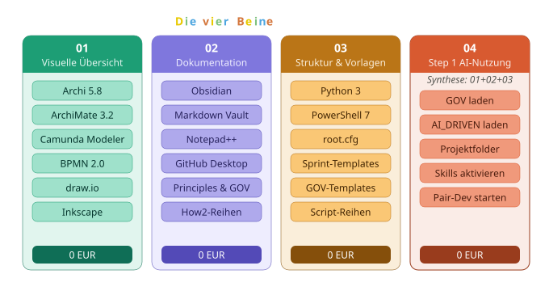
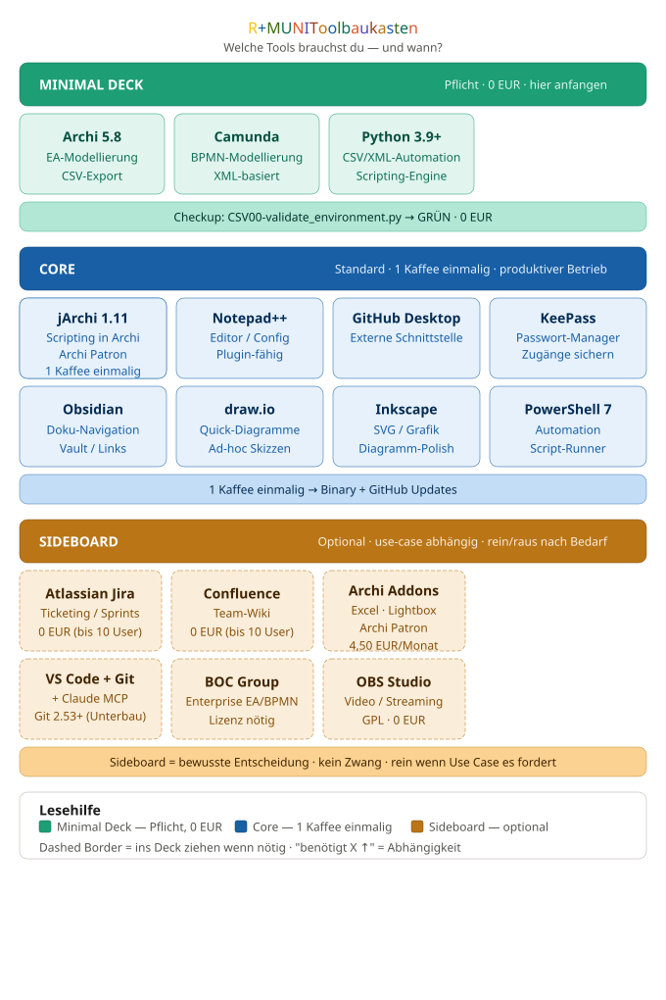

# R+MUNI

> *Eine Vorgehensweise, viele Werkzeuge. Eine Philosophie.*

---

## Was ist R+MUNI?

R+MUNI ist ein Applikations Ökosystem für Visualisierung
Im Kern sind es vier "Beine" die den (R) "ESEL" tragen. **ohne schlechtes Gewissen, ohne versteckte Abo-Fallen, ohne Hintertüren.**

Entwickelt für den österreichischen KMU und für fast alle Fragestellungen geeignet! 
Nicht um die Antworten zu liefern, sondern um die Entscheidungsgrundlage ganzheitlich darzustellen. 

---

## Die vier Beine



R+MUNI steht auf vier Beinen:

**Bein 01 — Visuelle Übersicht**
ArchiMate 3.2, BPMN 2.0, SVG für alles dazwischen — *Das Bild*

**Bein 02 — Dokumentation & Wissen**
Markdown-Vault, GitHub, Principles & How2-Reihen, Reporting Funktionen — *Die Ordnung*

**Bein 03 — Struktur & Vorlagen**
Python-Scripts, PowerShell, Templates, root.cfg — *Der erste Schritt*

**Bein 04 — Erster Schritt in Richtung digitale Automatisierung **
Wer 01–03 kennt, hat den Kontext für KI-gestütztes Pair-Development — *Die Anschlussfähigkeit*

R+MUNI ist dabei die *Single Source of Truth* — alles andere wird daraus abgeleitet. Keine parallelen Wahrheiten notwendig, keine manuelle Excel Synchronisation, fast 😉 kein Chaos.

Details zur KI-Nutzung: [Install.txt](Install.txt) Abschnitt 3.8

---

## Die Philosophie dahinter

R+MUNI ist kein Produkt. Es ist eine **Vorgehensweise** nach offenen Normen, mit einer Open-Source-Toollandschaft als **Werkzeugkasten** — der dann auf einen Script-**Baukasten** für die Interaktion unter den Werkzeugen aufbaut.

Jeder Baustein hat seine klare Aufgabe. Jede Reihe hat einen klaren Zweck. Jede Erweiterung baut auf dem auf, was vorher stabil war — und verändert es nicht.

Das klingt nach Engineering. Es ist aber vor allem **Haltung**:
Dinge sollen funktionieren. Dauerhaft. Nachvollziehbar. Ohne versteckte Abhängigkeiten.

Der "Esel" ist und bleibt **kostenlos für Endanwender**. Das ist kein Zufall — das ist Grundsatz.
Archi ist kostenlos. Die Scripts sind kostenlos.
Wer R+MUNI nutzt, bekommt kein verstecktes Abo und keinen Lock-in, außer du magst gewisse Mehrwerte aus einer Applikation nutzen....

---

## Der Toolbaukasten — welche Tools brauchst du?

R+MUNI setzt ausschließlich auf frei verfügbare, stabile Open-Source-Werkzeuge. Der gesamte Kern-Stack kostet nichts — das ist kein Zufall, sondern Grundsatz.




> Archi ist das Herz von R+MUNI. Das Team stellt es kostenlos zur Verfügung — wer Mehrwert sieht, kann als Patron unterstützen: [archimatetool.com/donate](https://www.archimatetool.com/donate/)

---

## Der Script-Baukasten — wie funktioniert die Automatisierung?

R+MUNI automatisiert Datenflüsse zwischen den Tools über Python-Scripts. Das Prinzip dahinter ist bewusst einfach:

> *1 Script = 1 Aufgabe.*

Kein Script macht zwei Dinge gleichzeitig. Kein Flow enthält versteckte Logik. Was ein Script tut, ist aus seinem Namen und seinem Log unmittelbar nachvollziehbar.

### Wie ein Flow funktioniert

Ein **Flow** beschreibt *was* passiert. Die **Scripts** implementieren *wie* es passiert.

### Die Script-Reihen

R+MUNI organisiert seine Scripts in klar abgegrenzte **Reihen**. Jede Reihe hat einen festen Kürzel-Präfix:

| Reihe | Kürzel | Zweck |
|---|---|---|
| **HLP** | `HLP` | Hilfsfunktionen — Basis für alle anderen Reihen (Root-Auflösung, Backup, Server) |
| **XML** | `XML` | Zentraler Backbone — alle Datenflüsse konvergieren hier, Master-XML-Pflege und -Verarbeitung |
| **CSV** | `CSV` | Import-Kanal — strukturierte Aufbereitung externer Daten für den Einstieg ins System |
| **M2B** | `M2B` | Master → BPMN — erstellt aus dem Modell heraus BPMN-Prozesshüllen |
| **ATL** | `ATL` | Atlassian-Integration — Confluence und Jira aus dem Modell heraus |
| **CLE** | `CLE` | Cleaning und Quality Gate — sauber rein, sauber raus |
| **ECM** | `ECM` | EasyCSVMapper — externe CSV-Quellen in ArchiMate importieren |
| **FLW** | `FLW` | Flow-Orchestrierung — der Scriptrunner selbst |
| **NBX** | `NBX` | Netzwerk-Scan — IST-Erfassung via nmap, Output für ECM |
| **SVG** | `SVG` | SVG-Reihe — automatisierte Konvertierung von Rasterbildern zu SVG |

Die vollständige Dokumentation aller Reihen (Principles, How2, Templates) liegt im separaten Dokumentations-Repository

Dieses Repo enthält bereits einige Templates.

### Was du als CARD-Nutzer wissen musst

Als CARD-Nutzer arbeitest du mit R+MUNI — du entwickelst es nicht. Das bedeutet in der Praxis:

**Du konfigurierst einmalig** die `root.cfg` — eine einzige Datei, ein einziger Eintrag:
```
rootfolder=<installationspfad>\R+MUNI <KUERZEL>
```
Alle Pfade leiten sich automatisch daraus ab. Danach greifst du diese Datei nur an wenn sich dein Basisverzeichnis ändert.

**Du baust dir deine Scriptreiehen** über den Scriptrunner (`FLW00-scriptrunner.py`) oder führst sie einfach in der PowerShell direkt aus. 

**Du liest `.txt`-Artefakte** (z.B. `run-scope.txt`, `model-scope.txt`) wenn du den aktuellen Workflow-Stand prüfen möchtest — diese sind bewusst menschenlesbar.

**Du öffnest `.log`-Dateien** (in `02-stages\99-logs\`) nur wenn etwas schiefgelaufen ist — sie sind technische Debug-Ausgaben, kein normaler Workflow-Bestandteil.

---

## Ordnerstruktur — der rote Faden

R+MUNI folgt einer fixen Ordnerstruktur, die einmalig anzulegen ist. Die **bindende Referenz** für alle Details ist `structure.txt`.

Innerhalb von `R+MUNI <KUERZEL>\` gilt:

```
  root.cfg        ← (fast) einzige Konfiguration (einmalig anpassen)
  00-model\       ← Archi-Modell (read-only für Scripts)
  01-artifacts\   ← alle abgeleiteten Artefakte
  02-stages\      ← Laufzeit-Artefakte und Logs
```


---

## Wer arbeitet mit R+MUNI? — Vier Varianten, vier Welten

_variantenS104.svg)

R+MUNI unterscheidet bewusst zwischen vier Varianten — keine Hierarchie, sondern Kontexttrennung.

**CARD** ist der spielerische Einstieg — minimal, ohne Fachbegriffe, sofort nutzbar. Für Vereine, Privatpersonen und alle die R+MUNI ohne Vorkenntnisse erkunden wollen. Wer tiefer will findet den Weg.
(Also 1.2 Templates nehmen oder selbst bauen ;))

**R+MUNI** ist die eigentliche Lösung — für KMU bis 25 Personen konzipiert ist. Reduzierte Norm-Sprache, praxistauglich, ausreichend für erste Compliance-Anforderungen. Kein Vollregelwerk notwendig.
Wurde in Stage S8 bzw. Release 1 entwickelt und ist dort noch unter Associate Variante zu finden. Wird aber neu mit R+MUNI aufgebaut wenn es mich freut ;)

**EXPERT** ist das Vollprogramm — TOGAF ADM, ArchiMate 3.2 und BPMN 2.0 nach Norm, vollständig maschinenlesbar. Wird nicht separat geführt sondern bei Bedarf direkt aus der DEV-Umgebung abgeleitet. 
Für Normspezialisten oder die es noch werden möchten.

**DEV** ist der interne Entwicklungsmodus — Basis für alle anderen Varianten. Diese Variante ist lebend und kann als Basis für jede andere herangezogen und entsprechend reduziert werden.

Die vollständige Dokumentation wird im Rahmen der Installation bereitgestellt. 

---

## Mitmachen — als CARD-Nutzer oder als Developer

R+MUNI wird aktiv weiterentwickelt und befindet sich aktuell in **Beta — Phase 1.05**.

**Als CARD-Nutzer** kannst du R+MUNI in deiner Organisation einsetzen, Feedback geben und damit direkt beeinflussen wie das System weiterentwickelt wird. Der Feedback-Weg ist klar geregelt — kein schwarzes Loch, keine leeren Versprechen.

**Als Developer** kannst du auf der Blueprint-Basis aufbauen. Die Dokumentation ist offen, die Prinzipien sind nachvollziehbar, und jede Entscheidung hat einen dokumentierten Grund. R+MUNI ist **AI-driven entwickelt** — der gesamte Entwicklungsprozess ist dokumentiert und reproduzierbar.

Interesse? Meld dich — über GitHub Issues

---

## Technologie-Stack

R+MUNI setzt bewusst auf **frei verfügbare, stabile Werkzeuge**.

Den aktuellen Stand — was, wie und wann installiert wird — findest du in der Installationsanleitung:
[Install.txt](Install.txt)

Der Grundsatz: **Kein Tool im Kern-Stack kostet Geld.** Ergänzungen sind möglich — aber immer optional, immer transparent.

---

## Hintergrund & Entstehung

Die Reise von R+MUNI — vom ersten Lernprojekt bis zum Blueprint — ist ehrlich dokumentiert:
[RELEASE_NOTE_S105](https://github.com/arch-nullnull/R-MUNI/blob/main/RELEASE_NOTE_S105.md)

---

## Grafik & visuelle Identität

Die Flipchart-Illustrationen und die initiale visuelle Sprache von R+MUNI wurden inspiriert durch die Arbeit von **Nadine Rossa**, Grafikerin und Illustratorin.

→ [nadine-rossa.de](https://nadine-rossa.de/) | [sketchnote-love.com](https://sketchnote-love.com/)

---

## Archi Team

→ [archimatetool.com](https://www.archimatetool.com/) | [Spenden & unterstützen](https://www.archimatetool.com/donate/)

---

## Lizenz

MIT License — siehe [LICENSE](LICENSE)

---

*R+MUNI Blueprint — entwickelt von EUMAXL | Beta — Phase 1.05 | 2026*
